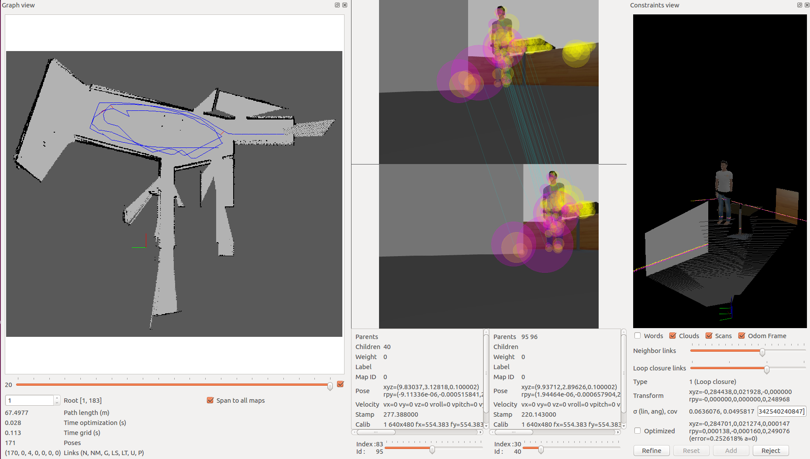

# mapMyWorld
Project 5 of the Udacity Robotics Nanodegree Program

# Overview
This project uses the ROS RTAB-Map package to map an environment. 

# Prerequisites and Dependencies
ROS and Gazebo installed on Linux workspace

Dependencies:
```
$ sudo apt-get install ros-kinetic-navigation ros-kinetic-map-server ros-kinetic-move-base ros-kinetic-amcl
```
RTAB-Map Package:
```
$ sudo apt-get install ros-kinetic-rtabmap-ros
```
Clone the repository, navigate to the root level directory, build the catkin files and launch gazebo world.
```
$ catkin_make
$ source devel/setup.bash
$ roslaunch my_robot world.launch
```
Open a new terminal and run the ```teleop``` node to move the robot.
```
$ source devel/setup.bash
$ rosrun teleop_twist_keyboard teleop_twist_keyboard.py
```
Open a new terminal and launch the mapping node.
```
$ source devel/setup.bash
$ roslaunch my_robot mapping.launch
```
Move the robot in the gazebo environment to create a map by going over a path a few times, and getting 3 loop closures is sufficient to map the environment.

The following tool can be used for exploring the database when done generatin it. It can be used to check for loop closures, generate 3D maps, extract images etc.
```
rtabmap-databaseViewer ~/.ros/rtabmap.db
```
# Map Generated
A map of the living room is generated by generating 3 loop closures on the map.




